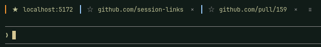
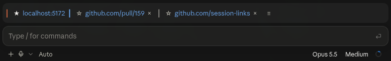

# session-links

Every link your session mentions, in one row above the prompt. Pin the ones you keep coming back to, dismiss the noise, open any of them in your browser, give one a name — all saved with the session. Nothing is ever fetched, and the model never sees any of it: zero tokens.

In the terminal:



In the Claude desktop app:



## Install

```sh
claude plugin marketplace add samaphp/session-links
claude plugin install session-links@session-links
```

Needs Claude Code 2.1.291 or later. To try it without installing: `claude --plugin-dir path/to/session-links`. To remove it: `claude plugin uninstall session-links`.

## Update

```sh
claude plugin update session-links
```

## Use

- Mention a link — yours or Claude's — and it becomes a chip above the prompt. The band stays hidden until there is one.
- `☆` pins a link (first seat, whole session) · the address opens your browser · `×` dismisses it (press twice) · `≡` opens `/links`.
- From five floating links, `dismiss all` clears them in two presses; the second answer beside it also opens `/links`, so you can restore the few you need. Pinned links are never touched.
- `/links` lists every link in three groups — pinned, floating, dismissed — with `open`, `pin`, `dismiss`, `copy`, `rename` and `restore`. The text box at the top adds an address you paste, pinned. `dismiss all` is there too, from two links.
- `rename` gives a link a name that leads on its chip and in the list; the address stays beneath it. Only in `/links`, never on the band.
- Keyboard: `ctrl+x` then `Tab` enters the band; `Tab` and the arrows walk, `Enter` presses, `Esc` returns. Mouse: the fullscreen layout (`/tui fullscreen`) makes every control clickable; in the default layout set `FORCE_HYPERLINK=1` and the addresses become hyperlinks your terminal opens on a click.
- Pins, dismissals and names survive exit and `--resume`.

The controls in full, the colours, what is collected and what is left out, terminal notes and how it works: [docs/reference.md](docs/reference.md).

## Develop

```sh
git clone https://github.com/samaphp/session-links
cd session-links
claude --plugin-dir .                 # loads from disk, hot-reloads on save
claude plugin validate .
claude plugin test .
npx -y -p typescript tsc -p .         # once a load has written .claude-plugin/types/
```

## License

MIT. See [LICENSE](LICENSE).
